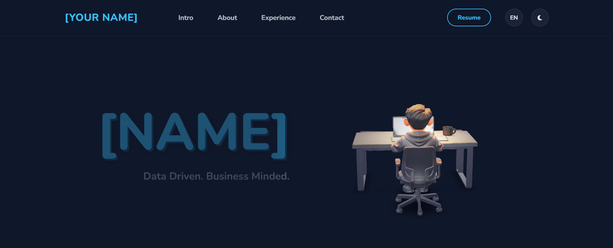

# 🚀 3D Interactive Portfolio Template

A modern, responsive portfolio template featuring a **3D interactive avatar**, **spotlight effects**, and **dark/light mode**. 

Perfect for Data Analysts, Developers, and Creatives.

## ✨ Features
- **3D Interaction:** Pendulum animation using `<model-viewer>`.
- **Spotlight Effect:** Dynamic lighting that follows the mouse.
- **Responsive:** Looks great on Mobile & Desktop.
- **No Frameworks:** Pure HTML/CSS/JS.

## 🛠️ How to Use

1. **Clone/Download** this repository.
2. **Edit `index.html`:** Replace `[Your Name]` and other placeholders.
3. **Edit `assets/js/main.js`:** Update your bio, experience, and translations (EN/ZH).
4. **Replace Assets:**
   - **Avatar:** Replace `assets/images/avatar.glb` with your own 3D model.
   - **Resume:** Add your PDF to `assets/docs/`.

## 🚀 Deployment
Simply drag and drop the folder to [Netlify Drop](https://app.netlify.com/drop) or use GitHub Pages.

## 📄 License
Open source under the [MIT License](LICENSE). Free to use!

---

*Created by [Allen Su](https://github.com/Allen-so)*
